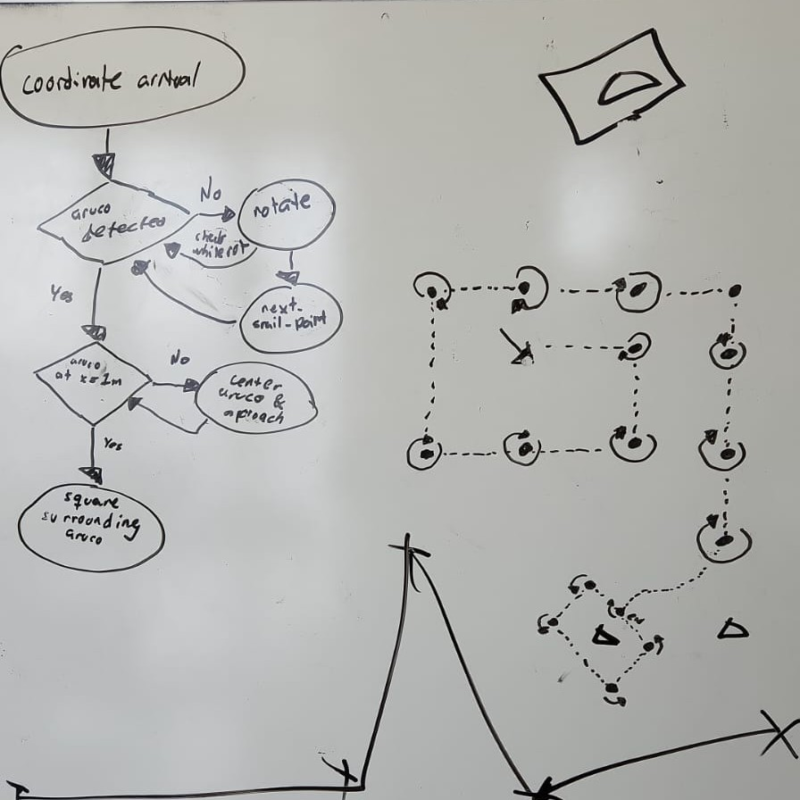
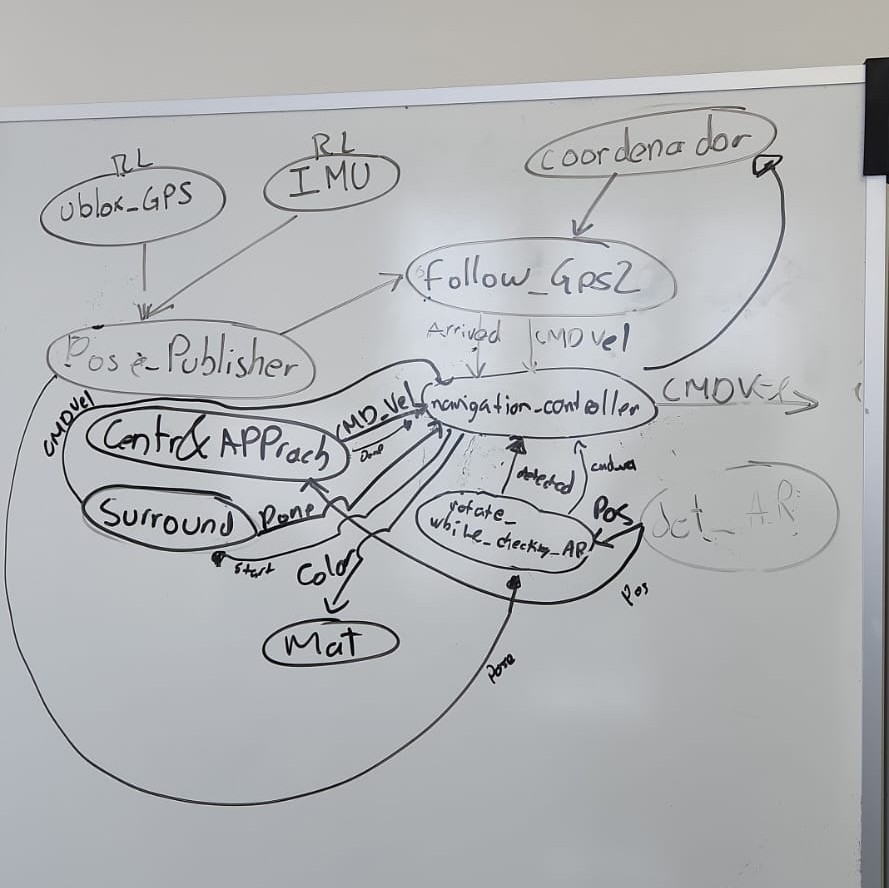

For 2023 the logic that will be used for the autonomous navigation mission of the URC is described by the following flow chart: 

The process described on this flowchart will be achieved using the following ROS nodes and topics:

All nodes are located on the scripts folder and have the following correspondance

| name of the node on the diagram | name of the script        |
|---------------------------------|---------------------------|
| Pose_Publisher                  | odom_publisher.py         |
| navigation_controller           | NavigationController.py   |
| centr & Approach                | center_and_approach.py    |
| rotate_while_detecting_AR       | rotateWhileDetectingAr.py |
| follow_Gps2                     | follow_gps3.py            |

The nodes that are in the diagram and are not listed on this table are in a different package, please see the other quantum robotics repos for reference